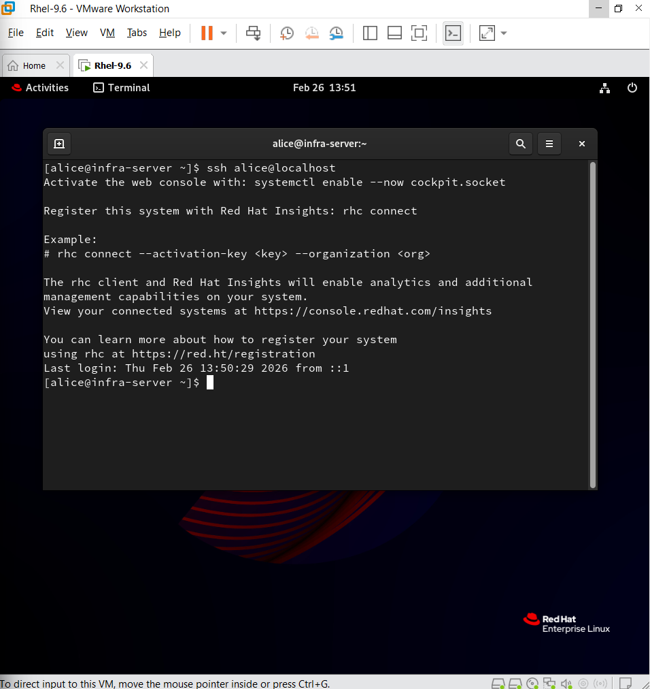
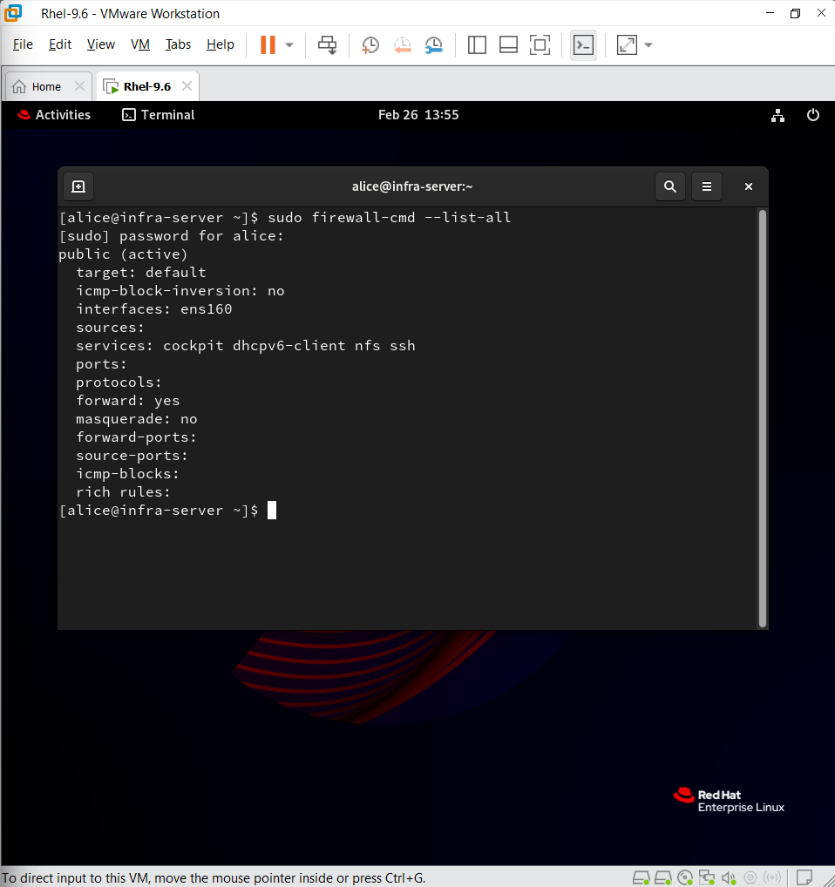
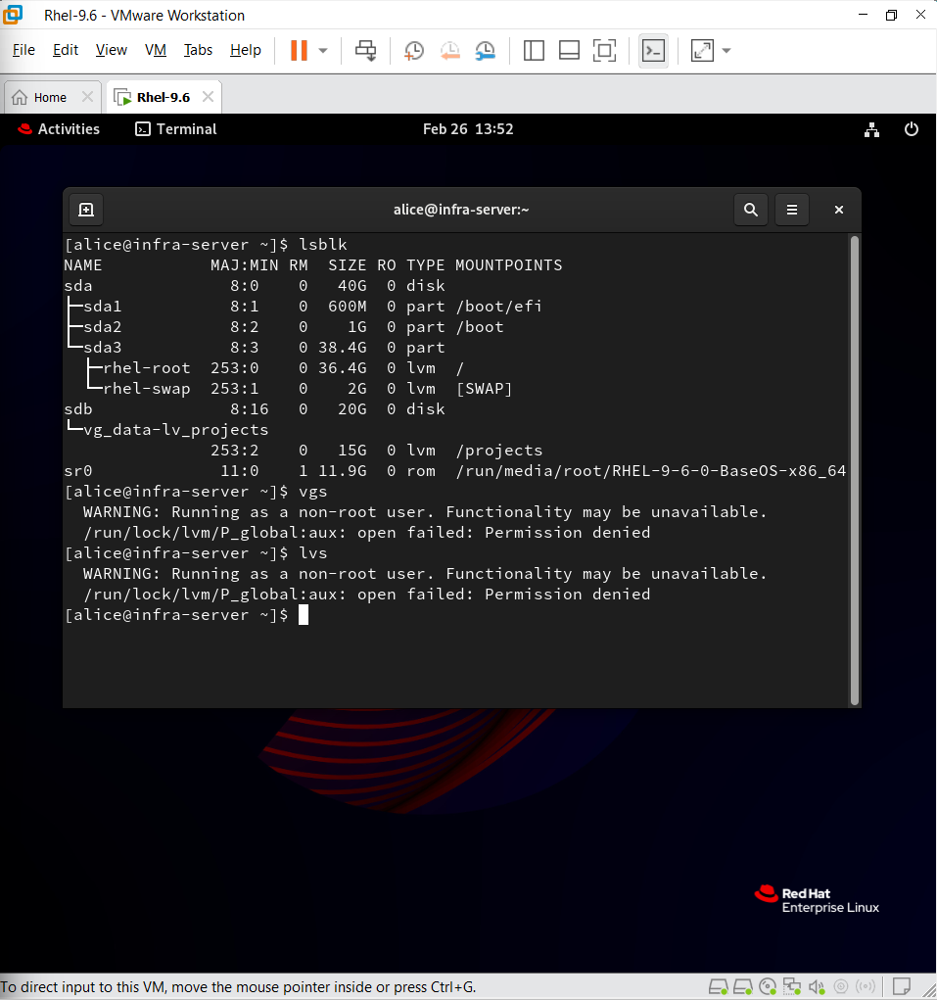
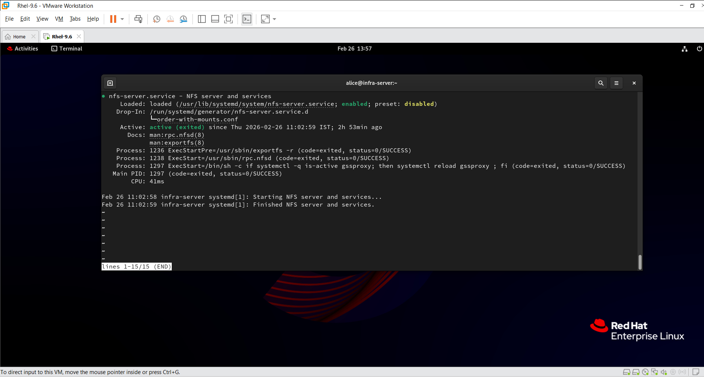

# Enterprise Linux Infrastructure Setup and Hardening

This project demonstrates the complete setup and hardening of an enterprise-level Linux server using RHEL 9.  

The objective was to simulate a real-world production environment by configuring secure remote access, firewall policies, logical volume management (LVM), network file sharing (NFS), and system service management.

This project reflects hands-on system administration skills aligned with RHCSA-level competencies and enterprise infrastructure best practices.

---

## Technologies Used

- RHEL 9
- LVM (Logical Volume Manager)
- SSH (Secure Remote Access)
- Firewalld
- NFS (Network File System)
- Systemctl
- SELinux

---

## Project Goals

- Configure and secure SSH with key-based authentication
- Implement firewall rules to control network traffic
- Create and manage logical volumes using LVM
- Configure NFS server for centralized file sharing
- Apply basic system hardening practices
- Validate configuration using real-world testing methods

---

## Infrastructure Overview

- Single RHEL 9 server deployed on VMware
- Dedicated LVM disk for storage management
- Secure SSH login using key authentication
- Firewall rules configured using firewalld
- NFS service configured and tested locally

---

---

## Project Screenshots

### SSH Key-Based Authentication

### Firewall Configuration

### LVM Storage Setup

### NFS Server Configuration

